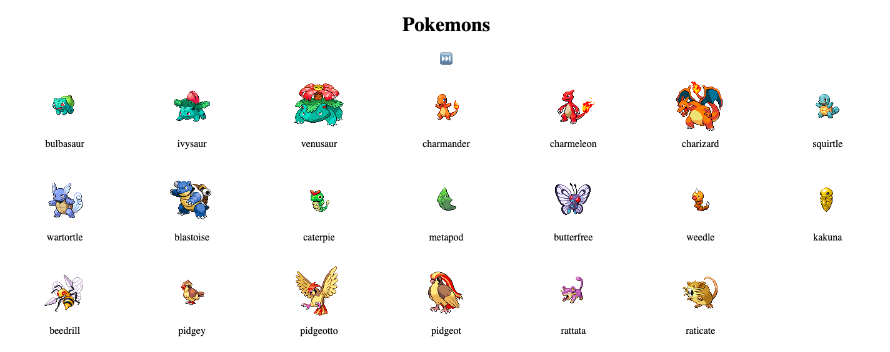

# VISUALIZADOR DE POKEMONES #

Pagina que, utlizando la [API de Pokemon](https://pokeapi.co/), va mostrando de a 20 pokemones en orden.

Ejercicio propuesto por [JonMircha](https://jonmircha.com/) en su curso ["Aprendiendo Javascript"](https://www.youtube.com/playlist?list=PLvq-jIkSeTUZ6QgYYO3MwG9EMqC-KoLXA)

Podes verla online [ACA](https://axdny.github.io/visualizador-de-pokemones/)

## Lenguajes utilizados ##
* HTML
* CSS
* Javascript
